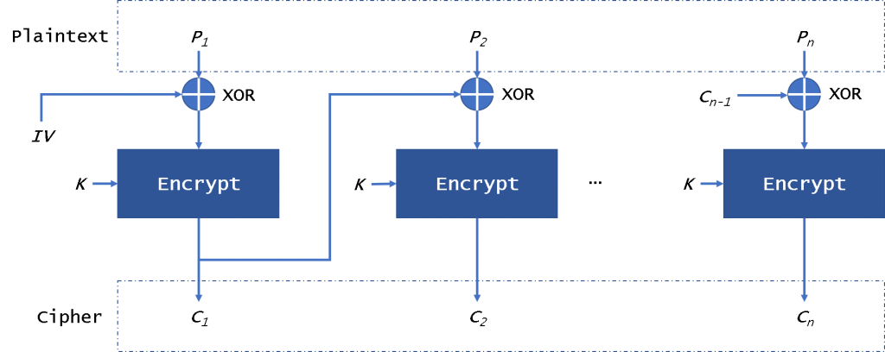
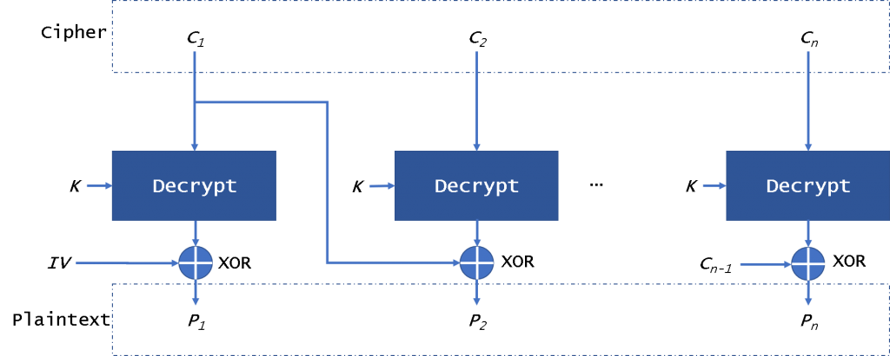

# Attaque Padding Oracle sur AES-CBC (Challenge Cryptopals - Set 3)

Ce projet implémente une simulation complète d'une **attaque par oracle de rembourrage (Padding Oracle Attack)** sur le mode de chiffrement AES-CBC, inspirée du set 3 de [cryptopals.com](https://cryptopals.com). Il démontre de manière concrète comment un attaquant peut déchiffrer un message secret sans jamais connaître la clé de chiffrement, et comment sécuriser le système en appliquant la contre-mesure **Encrypt-then-MAC (EtM)**.

---

## 🎯 Objectifs du Projet
- **Comprendre le mode CBC** : Exploiter les propriétés mathématiques de l'opération XOR après le déchiffrement AES.
- **Simuler un environnement réel** : Développer un serveur web Flask local jouant le rôle de l'oracle vulnérable.
- **Automatiser l'attaque** : Concevoir un script client capable de deviner le texte clair octet par octet via des requêtes HTTP.
- **Implémenter la défense** : Sécuriser l'architecture en intégrant un mécanisme HMAC basé sur le paradigme *Encrypt-then-MAC*.

---

## 📁 Structure du Projet
Le projet est divisé en deux rôles distincts (Architecture Client-Serveur) :
- `serveur.py` : L'application Flask locale. Elle détient la clé secrète AES et la clé MAC globale. Elle expose l'endpoint du défi chiffré et l'oracle de validation.
- `attaque.py` : Le script client offensif. Il récupère le texte chiffré mystère et interroge l'oracle en modifiant le vecteur d'initialisation (IV) pour extraire le texte clair.

---

## ⚙️ Installation et Lancement

### Prérequis
Assurez-vous d'avoir Python 3 installé, ainsi que les dépendances suivantes :
```bash
pip install flask requests pycryptodome
```

### Étape 1 : Lancer le serveur Flask
Dans un premier terminal, exécutez le serveur web local :
```bash
python serveur.py
```
Le serveur s'initialise et écoute sur `http://localhost:5000`.

### Étape 2 : Exécuter l'attaque
Dans un second terminal, lancez le script d'attaque :
```bash
python attaque.py
```

---

## 🧠 Comment fonctionne l'attaque ?

### 1. Le mécanisme standard d'AES-CBC
Le mode CBC (Cipher Block Chaining) enchaîne les blocs de données en appliquant une opération XOR.

* **Lors du chiffrement** : Chaque bloc de texte clair subit un XOR avec le bloc chiffré précédent (ou l'IV pour le premier bloc) avant de passer dans l'algorithme AES.
  
  

* **Lors du déchiffrement** : Le bloc chiffré passe d'avance dans l'algorithme AES pour donner un état intermédiaire, qui subit ensuite un XOR avec l'IV (ou le bloc chiffré précédent) pour révéler le texte clair.
  
  

### 2. L'exploitation de la faille
Le déchiffrement applique strictement la formule suivante sur chaque octet :
$$P = I \oplus IV$$

L'attaquant contrôlant l'IV envoyé au serveur, la modification de cet IV altère directement le texte clair final. En modifiant l'IV octet par octet (de droite à gauche) et en analysant la réponse de l'oracle Flask (`200 OK` si le padding PKCS#7 est valide, `400 Bad Request` s'il est invalide), l'attaquant en déduit mathématiquement l'état intermédiaire ($I$) :
$$I = \text{IV modifié} \oplus \text{Padding Exigé}$$

Une fois l'état intermédiaire $I$ entièrement reconstruit, le vrai texte clair d'origine est retrouvé sans jamais avoir extrait ni calculé la clé secrète AES.

---

## 🛡️ Contre-mesure : Encrypt-then-MAC (EtM)

Pour neutraliser l'attaque, le serveur a été mis à niveau avec l'approche **Encrypt-then-MAC**.

1. **À la génération (`/get_challenge`)** : Le serveur calcule un tag **HMAC-SHA256** directement sur l'intégralité du texte chiffré (`IV + Ciphertext`).
2. **À l'interrogation (`/oracle`)** : Avant toute tentative de déchiffrement, le serveur valide l'intégrité du message en recalculant le HMAC. 
   - Si l'attaquant modifie ne serait-ce qu'un bit de l'IV dans sa boucle de force brute, le HMAC devient invalide.
   - Le serveur rejette immédiatement la requête avec un code HTTP `403 Forbidden`, **sans jamais exécuter le déchiffrement ni exposer l'oracle de padding**.

### Résultat de la sécurisation
Une fois le pare-feu HMAC activé, le script d'attaque est instantanément aveuglé et échoue, ne récupérant qu'une suite de caractères incohérents, prouvant l'efficacité de la défense.

---

## 📚 Liens avec la Cybersécurité réelle
Cette vulnérabilité théorique a lourdement impacté la production mondiale par le passé. Elle est directement liée aux failles célèbres qui ont brisé les anciennes versions de SSL/TLS :
- **BEAST (2011)** sur TLS 1.0
- **POODLE (2014)** sur SSL 3.0

Ces attaques ont forcé l'industrie à abandonner le mode CBC au profit de modes de chiffrement modernes authentifiés dits **AEAD**, comme **AES-GCM**, qui intègrent nativement et de manière automatique la protection contre les modifications de données.
